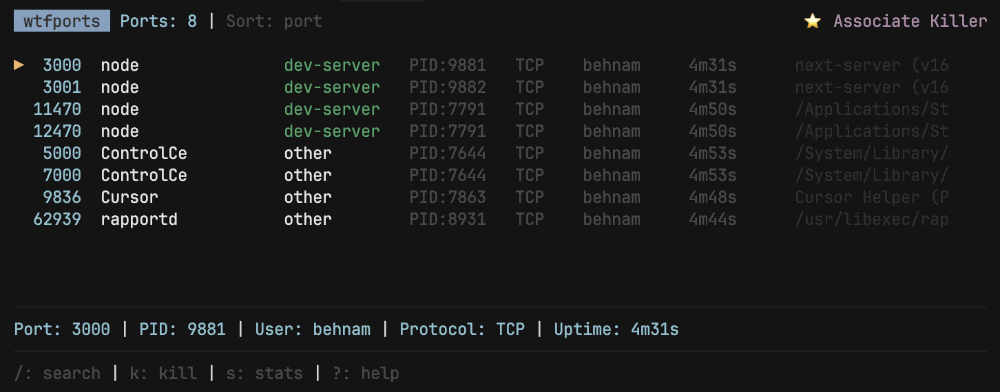

# wtfport

A cross-platform CLI tool for monitoring and managing network ports. Provides a terminal UI (TUI) for viewing active ports, killing processes, and managing port usage.



## Installation

### Standalone Binary (Recommended)

Download the pre-built binary for your platform from [Releases](https://github.com/yourusername/wtfport/releases).

### npm

```bash
npm install -g wtfport
```

### From Source

```bash
# Clone the repository
git clone <repository-url>
cd wtfport

# Install dependencies
npm install

# Build
npm run build:ts

# Run
npm run dev  # Development with Node.js
# or
node dist/cli.js    # Production with Node.js
```

## Usage

### Interactive TUI Mode

Launch the terminal UI:

```bash
wtfport
```

### Command Line Mode

Kill a process on a specific port:

```bash
wtfport kill 3000
wtfport kill --port 3000 --force
```

Filter and sort:

```bash
wtfport --type dev-server
wtfport --type "dev-*" --user "j*"
wtfport --sort port --type api
```

### Keyboard Shortcuts (TUI Mode)

- `↑/↓` - Navigate ports
- `/` - Search port (like `lsof -i :PORT`)
- `k` - Kill selected port
- `r` - Restart process
- `c` - Copy command to clipboard
- `v` - View full command
- `l` - View process logs
- `d` - Toggle details view
- `1/2/3` - Sort by port/process/pid
- `g` - Toggle group collapse
- `?` - Show/hide help
- `q` - Quit

## Platform Support

### macOS / Linux

Uses `lsof` and `ps` commands for port detection and process management.

### Windows

Uses `netstat`, `tasklist`, `taskkill`, and `wmic` for port detection and process management.

## Requirements

- **Runtime**: Node.js >= 18.0.0
- **Development**: Node.js >= 18.0.0
- **Binary Build**: Node.js 18.x (pkg currently supports up to Node.js 18)

For standalone binaries, no runtime is required - they are self-contained executables with Node.js 18 embedded.

**Note**: The `pkg` tool currently supports up to Node.js 18. When Node.js 22 support is added to pkg, update the build scripts to use `node22-*` targets.

**Build Process**: Binaries are created by bundling the code with `esbuild` (to handle ES modules) and then packaging with `pkg`.

## Development

### Run in development mode

```bash
npm run dev
```

### Type checking

```bash
npm run check-types
```

### Build TypeScript

```bash
npm run build:ts
```

## License

MIT
